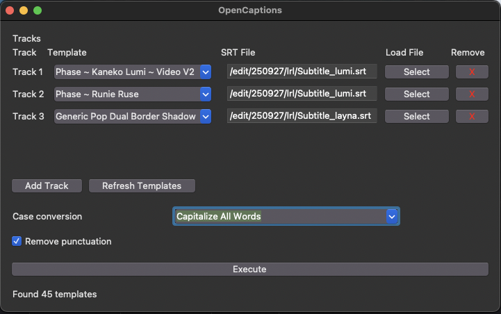

# Resolve OpenCaptions
A Free and Open Source Caption Tool for Davinci Resolve.

## Description
This is an open source tool that uses the Davinci API to create text+ caption track on a Davinci Timeline using a .srt files and a Text+ template.

- OpenCaptions always work with the focused timeline, no need to restart it when you change the timeline.
- OpenCaptions will always create a new text+ track, it will not overwrite existing text+ tracks.

## Features
- Create Text+ from a .srt file and a Text+ template.
- Remove punctuation (optional)
- Case conversion [none lover case, upper case, capitalize all words]

## Setup
1. Install [DaVinci Resolve](https://www.blackmagicdesign.com/products/davinciresolve) 19 or higher.
2. Install [Python](https://www.python.org/downloads/) 3.10 or higher.
3. Install OpenCaptions by placing the "OpenCaptions.py" file in the following folder:
    
    Windows 
    > C:\ProgramData\Blackmagic Design\DaVinci Resolve\Fusion\Scripts\Comp\
    
    macOS  
    > /Library/Application Support/Blackmagic Design/DaVinci Resolve/Fusion/Scripts/Comp/
4. Restart Davinci Resolve.

## Usage
2. Create a "Captions Templates" folder in your Media Pool. 
3. Place your Text+ templates in it.
4. Write or generate your subtitles track.
5. Export your subtitle track to a .srt file. (skip this step if you created the subtitles outside of Davinci Resolve)
6. Run OpenCaptions from the resolve Workspace menu. `Workspace -> Scripts -> Comp -> OpenCaption`
7. Select your SRT file and your Text+ template.
8. Click "Execute".
9. Enjoy!

## Why Use OpenCaptions?
- Simple to use
- Totaly free
- Totally open source, you can audit the code, and make your own changes
- Cross-platform, you can use it on Windows, macOS and Linux
- Compatible with both Davinci Resolve Free and Davinci Resolve Studio (paid)

## Dependencies
- Python 3.10+
- tkinter (standard library)

## About

### Why the name "OpenCaptions"?
"Open" because It's opensource
"Captions" because it work on subtitles and captions
And Open captions are the name for subtitles burned directly into a videos, since we convert closed captions from srt to Text+ to be burned in as open captions, it's a fitting name

### Why make it?
The starting point of OpenCaptions is based on one of my older project [Resolve_TextPlus2SRT](https://github.com/david-ca6/Resolve_TextPlus2SRT). 
But TextPlus2SRT was more a custom script for my own use than anything else, it was missing a lot of features, it was only working with linux, required to type in a terminal, and it only allowed to convert SRT to TextPlus, nothing more. OpenCaptions is inteded to be a stronger base to work from to make a more powerful and user-friendly tool.

