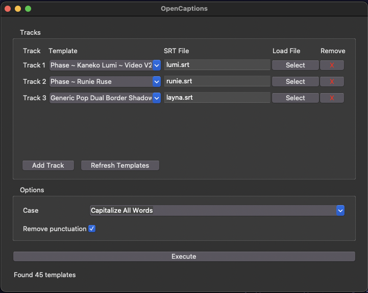

# Resolve OpenCaptions
Free & Open-Source subtitle to Text+ tool for DaVinci Resolve. No subscriptions. No paywalls. Just captions that work.

## Description
This is an open source tool that uses the DaVinci API to create a Text+ caption track on a DaVinci Timeline using .srt files and a Text+ template.

- OpenCaptions always works with the focused timeline, no need to restart it when you change the timeline.
- OpenCaptions will always create a new Text+ track, it will not overwrite existing Text+ tracks.

## Features
- Create Text+ from a .srt file and a Text+ template
- Queue up to five SRT files with different templates; each generates its own Text+ track
- Remove queued tracks before executing if you change your mind
- Remove punctuation (optional)
- Case conversion [none, lower case, upper case, capitalize all words]
- Multi-track support (up to five tracks) to easilly sub video with multiple speakers

## Setup
1. Install [DaVinci Resolve](https://www.blackmagicdesign.com/products/davinciresolve) 19 or higher.
2. Install [Python](https://www.python.org/downloads/) 3.10 or higher.
3. Install OpenCaptions by placing the "OpenCaptions.py" file in the following folder:
    
    Windows 
    > C:\ProgramData\Blackmagic Design\DaVinci Resolve\Fusion\Scripts\Comp\
    
    macOS  
    > /Library/Application Support/Blackmagic Design/DaVinci Resolve/Fusion/Scripts/Comp/

4. Restart DaVinci Resolve.

## Usage
1. Create a "Captions Templates" folder in your Media Pool. 
2. Place your Text+ templates in it.
3. Write or generate your subtitles track.
4. Export your subtitle track to a .srt file. (skip this step if you created the subtitles outside of DaVinci Resolve)
5. Run OpenCaptions from the Resolve Workspace menu. `Workspace -> Scripts -> Comp -> OpenCaptions`
6. Select up to five SRT/template pairs.
7. Click "Execute"; tracks are generated in order.

## Why Use OpenCaptions?
- Simple to use
- Totally free
- Totally open source, you can audit the code, and make your own changes
- Cross-platform, you can use it on Windows, macOS, and Linux
- Compatible with both DaVinci Resolve Free and DaVinci Resolve Studio (paid)

## Dependencies
- Python 3.10+
- tkinter (standard library)

## About

### Why the name "OpenCaptions"?
"Open" because it's open source  
"Captions" because it works on subtitles and captions  
And open captions are the name for subtitles burned directly into a video. Since we convert closed captions from SRT to Text+ to be burned in as open captions, it's a fitting name.

### Why make it?
The starting point of OpenCaptions is based on one of my older projects, [Resolve_TextPlus2SRT](https://github.com/david-ca6/Resolve_TextPlus2SRT).  
But TextPlus2SRT was more a custom script for my own use than anything else; it was missing a lot of features, it only worked with Linux, required typing in a terminal, and it only allowed converting SRT to TextPlus, nothing more. OpenCaptions is intended to be a stronger base to work from to make a more powerful and user-friendly tool.
